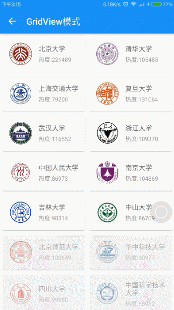
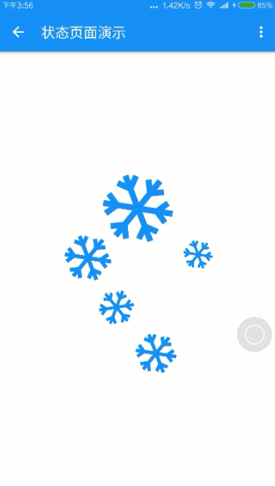
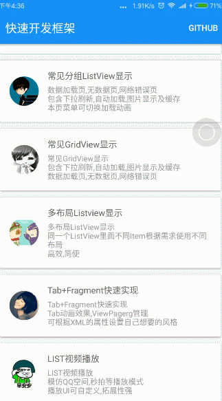

# RapidDevelop-Android快速开发框架
 - 框架持续更新中
 - 这个框架是从平时项目里用的比较多的框架里整合而来
 - 对本项目感兴趣的可以一起研究喜欢的朋友欢迎star
 - 同时也欢迎大家的宝贵意见issues
 - 如果大家对MVP模式的开发 网络爬虫以及缓存策略感兴趣的话可以看看我最新写的[Freebook](https://github.com/80945540/FreeBook)
 - 邮箱:mychinalance@gmail.com
 - [API地址](http://112.74.93.67/index.html)
 - [下载APK](http://fir.im/LCRapidDevelop) 

###[English](README_EN.md)
--------
##功能说明
 - 异常崩溃统一管理
 - retrofit rxjava okhttp rxcache------------------------------网络请求以及网络缓存
 - Demo采用MVP模式开发------------------------------------数据逻辑复用,便于维护升级
 - 下拉刷新 上拉加载 及自动加载---------------------------实现监听方便快捷
 - RecyclerView设配器------------------------------------------再也不需要写ViewHolder
 - RecyclerView item加载动画--------------------------------多种动画效果一行代码解决
 - 页面状态统一管理 加载中  无数据  无网络-------------所有页面均可添加
 - 图片显示与缓存 GIF图片显示
 - Tab+Fragment快速实现
 - 视频播放(仿QQ空间,秒拍等List播放)

--------

##效果图展示
       

--------------

##使用说明

导入 lcrapiddeveloplibrary 到项目

在 build.gradle 的 dependencies 添加:

    dependencies {
    compile fileTree(include: ['*.jar'], dir: 'libs')
    ....
    compile project(':lcrapiddeveloplibrary')
    }
##轻松实现异常统一管理
MyApplication里面初始化就可以了
```
public class MyApplication extends Application {

   
    @Override
    public void onCreate() {
        super.onCreate();
       
        //初始化异常管理工具
        Recovery.getInstance()
                .debug(true)//关闭后 在错误统一管理页面不显示异常数据
                .recoverInBackground(false)
                .recoverStack(true)
                .mainPage(WelcomeActivity.class)//恢复页面
                .init(this);
    }
}
```

##轻松实现 状态页面 下拉刷新 自动加载 item动画
首先layout.xml里面的编写啦 列表页面基本都是这个套路
```
<!--ProgressActivity用于状态页的控制 比如加载中  网络异常  无数据  适合任何页面-->
<com.xiaochao.lcrapiddeveloplibrary.viewtype.ProgressActivity
    xmlns:progressActivity="http://schemas.android.com/apk/res-auto"
    android:id="@+id/progress"
    android:layout_width="match_parent"
    android:layout_height="match_parent">
    <LinearLayout
        android:layout_width="match_parent"
        android:layout_height="match_parent"
        android:orientation="vertical"
        >
        <!--SpringView下拉刷新-->
        <com.xiaochao.lcrapiddeveloplibrary.widget.SpringView
            android:id="@+id/springview"
            android:layout_width="match_parent"
            android:layout_height="match_parent"
            android:background="#FFFFFF"
            >
            <android.support.v7.widget.RecyclerView
                android:id="@+id/rv_list"
                android:layout_width="match_parent"
                android:layout_height="match_parent"
                android:background="#eeeeee"/>
        </com.xiaochao.lcrapiddeveloplibrary.widget.SpringView>

    </LinearLayout>
</com.xiaochao.lcrapiddeveloplibrary.viewtype.ProgressActivity>
```
然后就是Activity里面的编写了 这个例子里使用MVP模式编写感兴趣的看我最新写的[Freebook](https://github.com/80945540/FreeBook)
```
public class ListvViewActivity extends AppCompatActivity implements BaseQuickAdapter.RequestLoadMoreListener,SpringView.OnFreshListener,SchoolListView {

    RecyclerView mRecyclerView;
    ProgressActivity progress;
    private Toolbar toolbar;
    private BaseQuickAdapter mQuickAdapter;
    private int PageIndex=1;
    private SpringView springView;
    private SchoolListPresent present;

    @Override
    protected void onCreate(Bundle savedInstanceState) {
        super.onCreate(savedInstanceState);
        setContentView(R.layout.activity_listv_view);
        initView();
    }


    private void initView() {
        present = new SchoolListPresent(this);
        mRecyclerView = (RecyclerView) findViewById(R.id.rv_list);
        springView = (SpringView) findViewById(R.id.springview);
        //设置下拉刷新监听
        springView.setListener(this);
        //设置下拉刷新样式
        springView.setHeader(new RotationHeader(this));
        //springView.setFooter(new RotationFooter(this));mRecyclerView内部集成的自动加载  上啦加载用不上   在其他View使用
        progress = (ProgressActivity) findViewById(R.id.progress);
        //设置RecyclerView的显示模式  当前List模式
        mRecyclerView.setLayoutManager(new LinearLayoutManager(this));
        //如果Item高度固定  增加该属性能够提高效率
        mRecyclerView.setHasFixedSize(true);
        //设置页面为加载中..
        progress.showLoading();
        //设置适配器
        mQuickAdapter = new ListViewAdapter(R.layout.list_view_item_layout,null);
        //设置加载动画
        mQuickAdapter.openLoadAnimation(BaseQuickAdapter.SCALEIN);
        //设置是否自动加载以及加载个数
        mQuickAdapter.openLoadMore(6,true);
        //将适配器添加到RecyclerView
        mRecyclerView.setAdapter(mQuickAdapter);
         //设置自动加载监听
        mQuickAdapter.setOnLoadMoreListener(this);
        //请求网络数据
        present.LoadData(PageIndex,12,false);
    }
   //自动加载
    @Override
    public void onLoadMoreRequested() {
        PageIndex++;
        present.LoadData(PageIndex,12,true);
    }
    //下拉刷新
    @Override
    public void onRefresh() {
        PageIndex=1;
        present.LoadData(PageIndex,12,false);
    }
  
    /*
    * MVP模式的相关状态
    *
    * */
    @Override
    public void showProgress() {
        progress.showLoading();
    }

    @Override
    public void hideProgress() {
        progress.showContent();
    }

    @Override
    public void newDatas(List<UniversityListDto> newsList) {
        //进入显示的初始数据或者下拉刷新显示的数据
        mQuickAdapter.setNewData(newsList);//新增数据
        mQuickAdapter.openLoadMore(10,true);//设置是否可以下拉加载  以及加载条数
        springView.onFinishFreshAndLoad();//刷新完成
    }

    @Override
    public void addDatas(List<UniversityListDto> addList) {
        //新增自动加载的的数据
        mQuickAdapter.notifyDataChangedAfterLoadMore(addList, true);
    }

    @Override
    public void showLoadFailMsg() {
        //设置加载错误页显示
        progress.showError(getResources().getDrawable(R.mipmap.monkey_cry), Constant.ERROR_TITLE, Constant.ERROR_CONTEXT, Constant.ERROR_BUTTON, new View.OnClickListener() {
            @Override
            public void onClick(View v) {
                PageIndex=1;
                present.LoadData(PageIndex,12,false);
            }
        });
    }

    @Override
    public void showLoadCompleteAllData() {
        //所有数据加载完成后显示
        mQuickAdapter.notifyDataChangedAfterLoadMore(false);
        View view = getLayoutInflater().inflate(R.layout.not_loading, (ViewGroup) mRecyclerView.getParent(), false);
        mQuickAdapter.addFooterView(view);
    }

    @Override
    public void showNoData() {
        //设置无数据显示页面
        progress.showEmpty(getResources().getDrawable(R.mipmap.monkey_cry),Constant.EMPTY_TITLE,Constant.EMPTY_CONTEXT);
    }
}
```
##轻松实现视频列表播放 
列表部分和上面的一样就不说了,我这边主要描叙视频播放的部分 是在不懂得可以clone到本地仓库跑一边

item_layout.xml 
```
<LinearLayout
        android:layout_width="match_parent"
        android:layout_height="wrap_content"
        android:padding="5dp"
        android:orientation="vertical">
        <com.xiaochao.lcrapiddeveloplibrary.Video.JCVideoPlayerStandard
            android:id="@+id/video_list_item_playr"
            android:layout_width="match_parent"
            android:layout_height="wrap_content"/>
        <LinearLayout
            android:layout_width="match_parent"
            android:layout_height="match_parent"
            android:orientation="horizontal"
            android:padding="5dp"
            android:gravity="center_vertical">
            <ImageView
                android:id="@+id/video_list_item_image"
                android:layout_width="100dp"
                android:layout_height="70dp"
                android:src="@mipmap/def_head"/>
            <LinearLayout
                android:layout_width="0dp"
                android:layout_weight="1"
                android:layout_height="wrap_content"
                android:layout_marginLeft="15dp"
                android:layout_marginTop="5dp"
                android:layout_marginBottom="5dp"
                android:layout_marginRight="10dp"
                android:orientation="vertical">
                <TextView
                    android:id="@+id/video_list_item_text_title"
                    android:layout_width="wrap_content"
                    android:layout_height="wrap_content"
                    android:textColor="#666666"
                    android:text="标题"
                    android:textSize="15dp"/>
                <TextView
                    android:id="@+id/video_list_item_text_context"
                    android:layout_width="wrap_content"
                    android:layout_marginTop="5dp"
                    android:textColor="#999999"
                    android:textSize="13dp"
                    android:text="内容"
                    android:lines="3"
                    android:ellipsize="end"
                    android:layout_height="wrap_content"/>
            </LinearLayout>
        </LinearLayout>

    </LinearLayout>
```
然后就是adapter里面对视频控件的赋值处理
```
public class VideoLisViewAdapter extends BaseQuickAdapter<VideoListDto> {

    public VideoLisViewAdapter(int layoutResId, List<VideoListDto> data) {
        super(layoutResId, data);
    }

    public VideoLisViewAdapter(List<VideoListDto> data) {
        super(data);
    }

    public VideoLisViewAdapter(View contentView, List<VideoListDto> data) {
        super(contentView, data);
    }

    @Override
    protected void convert(BaseViewHolder helper, VideoListDto item) {
        helper.setText(R.id.video_list_item_text_title,item.getTitle()).setText(R.id.video_list_item_text_context,item.getIntroduction());
        //Glide加载图片  并且支持gif动图
        Glide.with(mContext)
                .load(item.getPictureUrl())
                .crossFade()
                .placeholder(R.mipmap.def_head)
                .into((ImageView) helper.getView(R.id.video_list_item_image));
        //对视频的赋值 添加视频播放地址(使用原地址  .mp4之类的  这个要注意)和标题
        ((JCVideoPlayerStandard)helper.getView(R.id.video_list_item_playr)).setUp(item.getAppVideoUrl(),item.getTitle());
        Glide.with(mContext)
                .load(item.getPictureUrl())
                .crossFade()
                .placeholder(R.mipmap.main_mini_m)
                .into((((JCVideoPlayerStandard) helper.getView(R.id.video_list_item_playr)).thumbImageView));
    }
}
```
###Tab+Fragment快速实现
还是原来的配方 layout.xml
```
<?xml version="1.0" encoding="utf-8"?>
<LinearLayout xmlns:android="http://schemas.android.com/apk/res/android"
    xmlns:tools="http://schemas.android.com/tools"
    android:layout_width="match_parent"
    android:layout_height="match_parent"
    xmlns:app="http://schemas.android.com/apk/res-auto"
    android:orientation="vertical"
    tools:context="com.xiaochao.lcrapiddevelop.UI.Tab.TabActivity">
    <android.support.v7.widget.Toolbar
        android:id="@+id/toolbar"
        android:layout_width="match_parent"
        android:layout_height="?attr/actionBarSize"
        android:background="?attr/colorPrimary"
        app:popupTheme="@style/AppTheme.PopupOverlay" />
    <!--显示头部滑块-->
    <FrameLayout
        android:id="@+id/tab"
        android:layout_width="match_parent"
        android:layout_height="wrap_content"
        android:background="#fff"
        />
    <android.support.v4.view.ViewPager
        android:id="@+id/viewpager"
        android:layout_width="match_parent"
        android:layout_height="match_parent"
        />
</LinearLayout>
```
然后就是头部的xml编写了
```
<com.xiaochao.lcrapiddeveloplibrary.SmartTab.SmartTabLayout
    xmlns:android="http://schemas.android.com/apk/res/android"
    xmlns:app="http://schemas.android.com/apk/res-auto"
    android:id="@+id/viewpagertab"
    android:layout_width="match_parent"
    android:layout_height="40dp"
    android:background="#FFFFFF"

    app:stl_defaultTabTextColor="@color/custom_tab"
    app:stl_distributeEvenly="true"
    app:stl_defaultTabTextHorizontalPadding="5dp"
    app:stl_indicatorColor="@color/title_bag"
    app:stl_indicatorCornerRadius="0dp"
    app:stl_indicatorInterpolation="smart"
    app:stl_indicatorThickness="3dp"
    app:stl_defaultTabTextSize="13dp"
    app:stl_dividerColor="@color/bag_gray"
    app:stl_dividerThickness="1dp"
    app:stl_overlineColor="@color/bag_gray"
    app:stl_underlineColor="#00000000"
    app:stl_defaultTabBackground="@color/bag_gray_transparent"
    />
```
完全可以按照自己想要的风格玩  下面表格为 可设置的属性

---------

|attr|描述|
|:--|:-------|
| stl_indicatorAlwaysInCenter    | 如果设置为真,有源标签总是显示在中心(如报摊google app),默认的错误| 
| stl_indicatorWithoutPadding	| 如果设置为true,画的指标没有填充选项卡中,默认的错误| 
| stl_indicatorInFront	| 画前的指示器下划线,默认的错误| 
| stl_indicatorInterpolation	| 行为的指标:“线性”或“智能”| 
| stl_indicatorGravity	| 图的位置指示器:“底”或“前”或“中心”,默认“底”| 
| stl_indicatorColor	| 标志的颜色| 
| stl_indicatorColors	| 多种颜色的指标,可以设置每个选项卡的颜色| 
| stl_indicatorThickness	| 厚度指标| 
| stl_indicatorWidth	| 的宽度指标,默认“汽车”| 
| stl_indicatorCornerRadius	| 圆角半径的指标| 
| stl_overlineColor	| 顶线的颜色| 
| stl_overlineThickness	| 顶线的厚度| 
| stl_underlineColor	| 颜色的底线| 
| stl_underlineThickness	| 厚度的底线| 
| stl_dividerColor| 	颜色之间的分隔器选项卡| 
| stl_dividerColors| 	多种颜色的选项卡之间的分隔器,可以设置每个选项卡的颜色| 
| stl_dividerThickness	| 分频器的厚度| 
| stl_defaultTabBackground	| 背景可拉的每个选项卡。 一般设置StateListDrawable| 
| stl_defaultTabTextAllCaps	| 如果设置为真,所有选项卡标题大写,违约事实| 
| stl_defaultTabTextColor	| 文本的颜色包括默认的选项卡| 
| stl_defaultTabTextSize	| 文本包括默认的选项卡的大小| 
| stl_defaultTabTextHorizontalPadding| 	文本布局填充默认的选项卡包括| 
| stl_defaultTabTextMinWidth| 	最小宽度的标签| 
| stl_customTabTextLayoutId	| 布局ID定义自定义选项卡。 如果你不指定一个布局,使用默认选项卡| 
| stl_customTabTextViewId	| 文本视图ID在一个自定义选项卡布局。 如果你不与customTabTextLayoutId定义,不工作| 
| stl_distributeEvenly	| 如果设置为真,每个选项卡都给出同样的重量,默认的错误| 
| stl_clickable	| 如果设置为false,禁用选择选项卡单击,违约事实| 
| stl_titleOffset	| 如果设置为“auto_center”,中间的幻灯片的位置选项卡中心将继续。 如果指定一个维度将抵消从左边缘,默认24 dp| 
| stl_drawDecorationAfterTab	| 画装饰(指示器和线)绘图选项卡后,默认的错误| 

--------

好了接下来就TabActivity
```
public class TabActivity extends AppCompatActivity {

    ViewGroup tab;
    ViewPager viewpager;
    @Override
    protected void onCreate(Bundle savedInstanceState) {
        super.onCreate(savedInstanceState);
        setContentView(R.layout.activity_tab);
        initView();
    }

    private void initView() {
        tab = (ViewGroup) findViewById(R.id.tab);
        viewpager = (ViewPager) findViewById(R.id.viewpager);
        //使用方才定义头部
        tab.addView(LayoutInflater.from(this).inflate(R.layout.tab_top_layout, tab, false));
    
        SmartTabLayout viewPagerTab = (SmartTabLayout) findViewById(R.id.viewpagertab);
        
        FragmentPagerItems pages = new FragmentPagerItems(this);
        
        //添加Fragment  FragmentPagerItem.of("头部显示标题", "建立的fragment","需要传值的可以传Bundle")
        for (int i=0;i<4;i++) {
            pages.add(FragmentPagerItem.of("Tab"+i, TabFragment.class));
        }

        FragmentPagerItemAdapter adapter = new FragmentPagerItemAdapter(
                getSupportFragmentManager(), pages);

        viewpager.setAdapter(adapter);
        viewPagerTab.setViewPager(viewpager);
    }
}
```

--------
##特别感谢
 - [JieCaoVideoPlayer](https://github.com/lipangit/JieCaoVideoPlayer)
 - [SpringView](https://github.com/liaoinstan/SpringView)
 - [SmartTabLayout](https://github.com/ogaclejapan/SmartTabLayout)
 - [BaseRecyclerViewAdapterHelper](https://github.com/CymChad/BaseRecyclerViewAdapterHelper)
 - [Recovery](https://github.com/80945540/Recovery)
